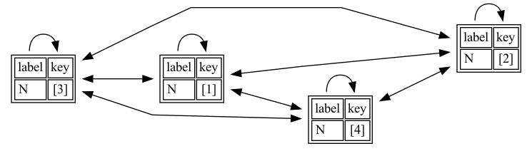

# Graphix Visualizer
A thin Graphviz + Python based visualizer for Graphix query results.

## Getting Started

1. Ensure that Python 3.8 and [https://graphviz.org/download/](Graphviz) are installed on your client machine, and that Graphix is installed (and launched) on your server machine. 
2. Install the requirements.txt file for your Python environment. 
    To create a virtual environment with all the necessary requirements, run the commands below.
    ```bash
    cd visualizer

    # Create an environment inside the visualizer/venv folder.
    python3 -m venv venv
    
    # Activate this environment.
    source venv/bin/activate
    
    # Install the requirements.
    python3 -m pip install -r requirements.txt
    ```
3. You should now be able to invoke the `visualize.{sh|py}` scripts to print Graphix path documents.
    Verify your runtime environment with the help flag.
    ```bash
     visualize.sh -h
    ```
    ```
    usage: visualize.py [-h] [-c CONFIG] [-s SHOW] [-f FILENAME] (-q QUERY | -qf QUERY_FILE | -j JSON | -jf JSON_FILE)
    
    Visualize results from Graphix using Graphviz.
    
    arguments:
      -h, --help                               show this help message and exit
      -c CONFIG, --config CONFIG               config for this visualizer
      -s SHOW, --show SHOW                     flag to immediately display the rendered graph
      -f FILENAME, --filename FILENAME         name of the file to write to
      -q QUERY, --query QUERY                  query string to issue to the Graphix server
      -qf QUERY_FILE, --query-file QUERY_FILE  query file to issue to the Graphix server
      -j JSON, --json JSON                     json(L) output string to directly visualize
      -jf JSON_FILE, --json-file JSON_FILE     json(L) output file to directly visualize
   ```
4. Let us print a small graph of four nodes with the script in `sample.sqlpp`.
   ```bash
   cd visualizer
   
   visualize.sh -qf sample.sqlpp   
   ```
   Will generate the following graph:
   
   
   

## 'Legal' Graphix Queries

The visualizer expects a certain structure to the results of a Graphix query.
Specifically, we expect a path object, or a document containing path objects whose vertices and edges are schema-decorated.

TODO (GLENN): Finish this documentation section.

## Modifying Graphviz Options
    
TODO (GLENN): Finish this documentation section.
